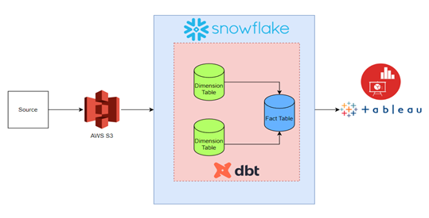
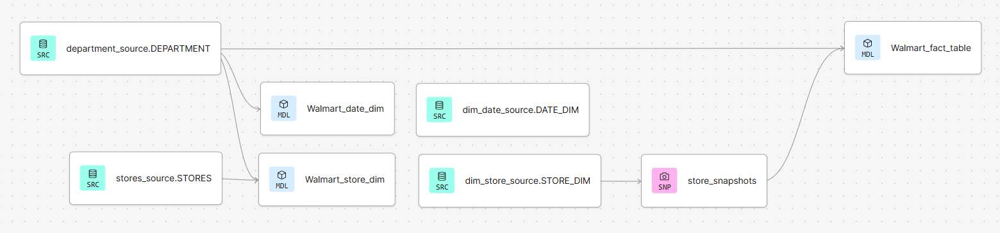

## Walmart Data Analysis (ETL SCD1 and SCD2 using DBT and Snowflake)

### Objective
In this project, we want to manually upload 3 CSV files into an S3 bucket, then configure Snowflake and dbt. Using dbt model running, all data is ingested into the Bronze layer inside Snowflake, then created dim and fact tables as needed. After that, using the snapshot option of dbt, we can handle data versioning and SCD2 action in our dim and fact tables, as soon as we upload new changed data into the S3 bucket using VS Code and Python. Finally, using Snowflake CLI and Python, and also with Tableau, we will analyse the data of Gold layer tables, as BI analysis.

